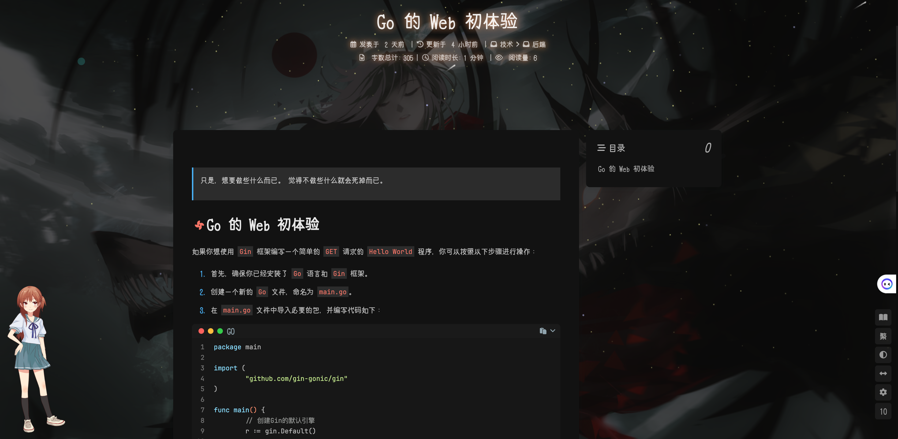
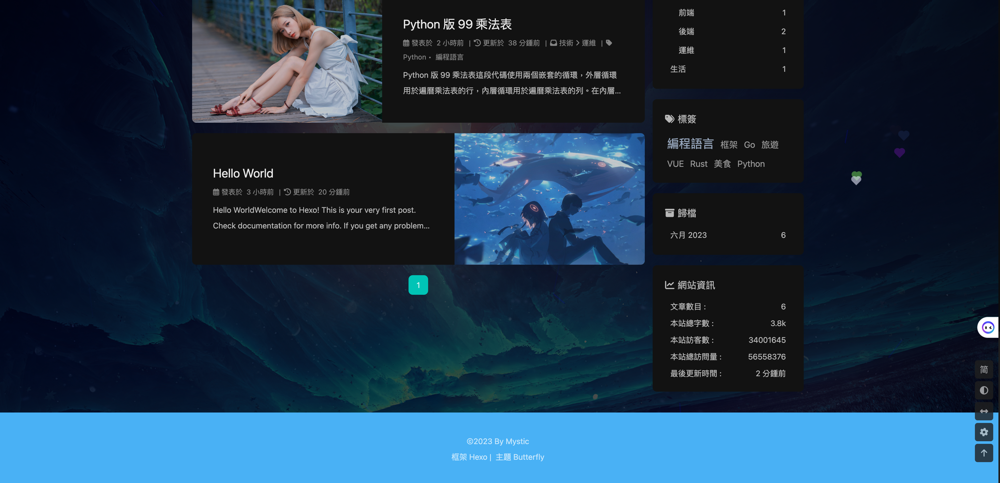

# hexo-theme-pretty

## 介绍

Hexo 配置 butterfly 主题（搭建模板 v2）

## 特点

- 更丰富的项目&主题配置！（唯一`URL`/本地搜索/字数统计等）
- 开箱即用！x3 


## 环境准备

> 基于 hexo-theme-butterfly 4.9.0 master 分支构建

- Node 环境
- Yarn 工具（全局安装）
- Hexo 库（全局安装）


## v2 如何使用

1. 克隆项目

```bash
git clone git@github.com:pokeyaro/hexo-theme-pretty.git@v2.0.0
```

2. 安装依赖

```bash
cd hexo-theme-pretty/
yarn
```

3. 渲染启动

```bash
hexo generate
hexo server
```

此时，在浏览器中访问 `http://localhost:4000`，应该能够看到我们的网站了。


## v2 截图





